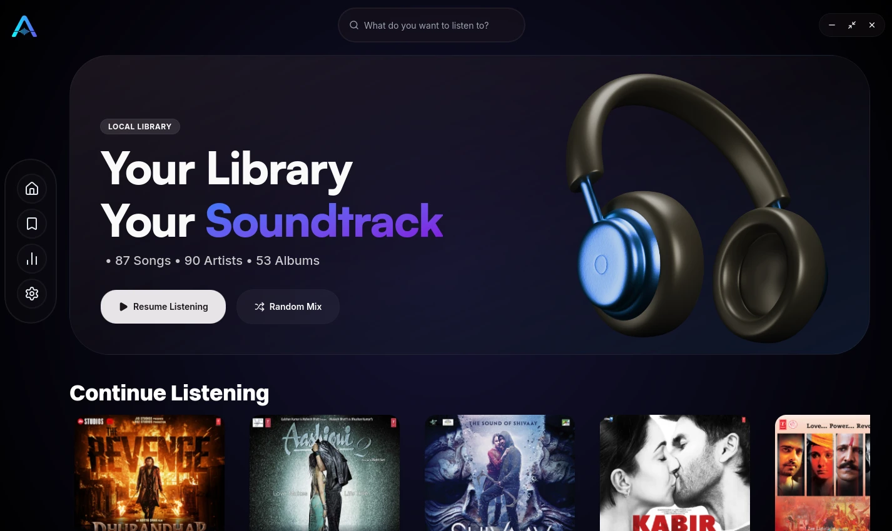
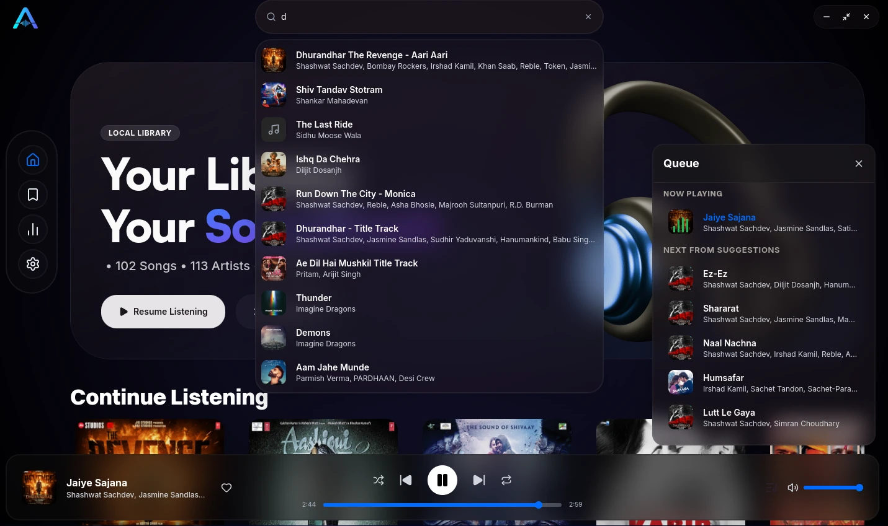
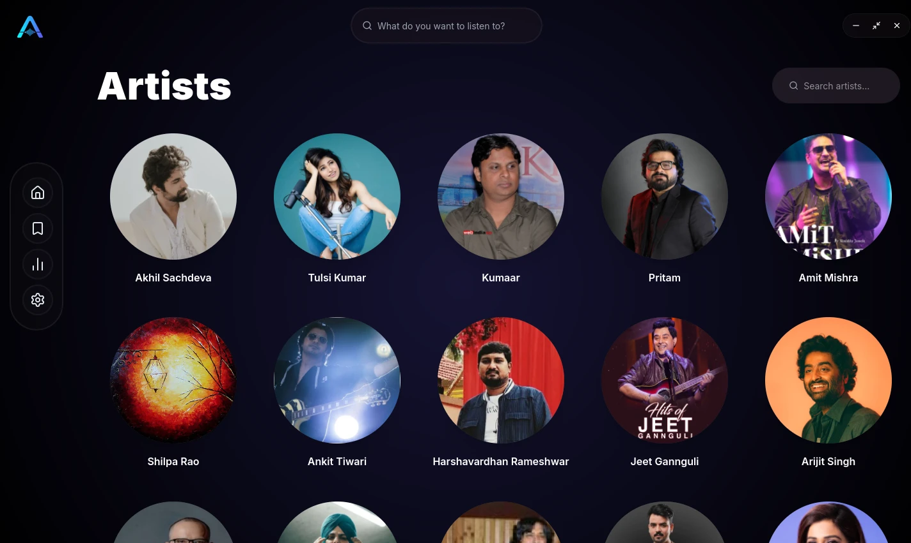
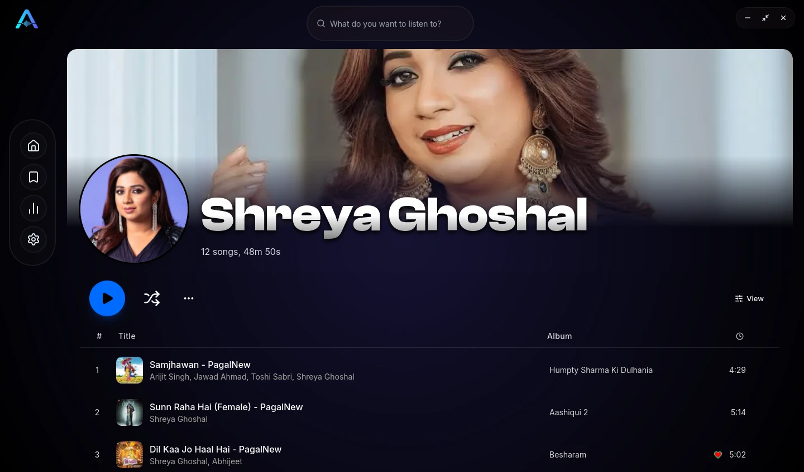
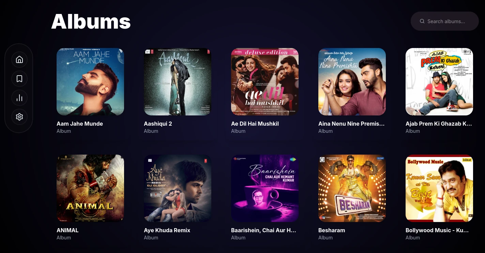
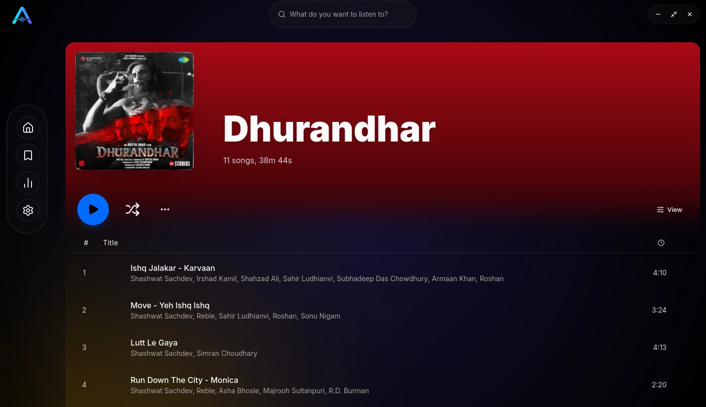
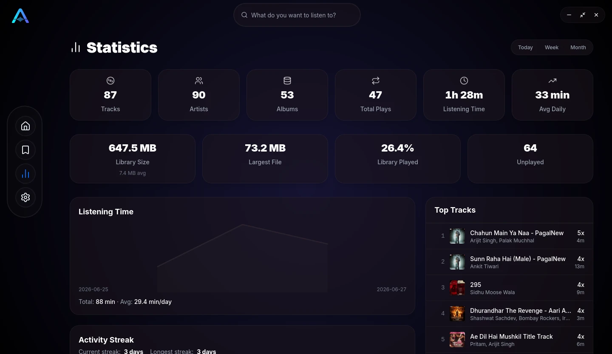
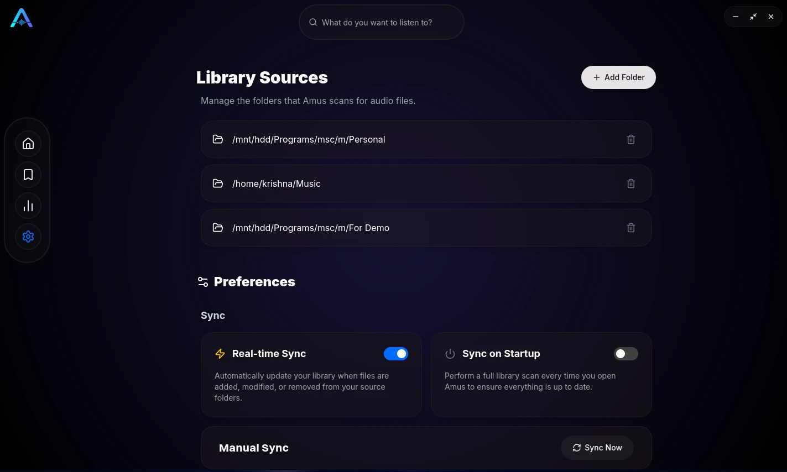

# AMUS

<div align="center">


**A fast, modern, privacy-focused local music player**

AMUS is built for people who own their music library. It runs completely offline, stays lightweight, and feels like a modern desktop app — not a web wrapper.

[](LICENSE)
[](https://www.rust-lang.org/)
[](https://tauri.app/)
[](https://kit.svelte.dev/)
[](https://github.com/Naitik4516/AMUS/releases/latest)

</div>

## Features

### Playback

- **Wide format support** — MP3, FLAC, WAV, OGG, M4A, AAC, OPUS (via rodio)
- **Advanced queue** — play next, drag-and-drop reorder, shuffle, and repeat
- **Auto-regeneration** — when the queue runs dry, similar tracks are suggested from artist/album match, play count, and randomness
- **Background playback** — keeps playing from the system tray when the window is closed
- **Mini player** — compact always-available window with art, track info, and controls
- **Stop / pause / seek** — full transport controls plus stop

### Library

- **Fast incremental scanning** — metadata extraction and cover art on scan
- **Real-time file watcher** — picks up added, modified, and deleted files automatically
- **Playlists** — create, rename, delete; add/remove tracks; custom or auto-generated cover art; quick “Add more” search on the playlist page
- **Favorites** — one-click toggle per track
- **Artist metadata** — automatic profile and banner images (Bing / DuckDuckGo)
- **In-memory library cache** — library loads once at startup for snappy browsing and fewer IPC round-trips

### Search & navigation

- **Fuzzy global search** — client-side [Fuse.js](https://www.fusejs.io/) with [extended search](https://www.fusejs.io/examples.html#extended-search) patterns
- **Type filters** — `/tracks`, `/artists`, `/albums`, `/playlists` slash commands
- **Context menus** — right-click tracks for play, queue, playlist, favorite, and more
- **Keyboard shortcuts** — app-wide and optional global media shortcuts (customizable)

### Insights & polish

- **Playback history & stats** — play counts, listening time, streaks, library growth, format distribution, hourly/weekday heatmaps, favorite trends
- **System tray** — play/pause, previous/next, show/hide, quit
- **Auto-updater** — updates from GitHub Releases (passive install on Windows)
- **OS media controls** — integrate with system media keys (MPRIS/SMTC/Now Playing)
- **File associations** — open audio files directly with AMUS
- **Modern UI** — custom title bar, themes, and a responsive library layout

## Advanced search

Open global search and type normally for fuzzy matching, or use these **extended patterns** to refine results (powered by Fuse.js extended search). You can combine them with type filters like `/tracks belver` or `/artists ^Tu`.

| Token      | Match type                 | Description                                       |
| ---------- | -------------------------- | ------------------------------------------------- |
| `belver`   | fuzzy-match                | Items that fuzzy match _belver_ (e.g. “Believer”) |
| `="Rebel"` | exact-match                | Items that are exactly _Rebel_                    |
| `'lofi`    | include-match              | Items that include _lofi_                         |
| `!lofi`    | inverse-exact-match        | Items that do not include _lofi_                  |
| `^Tu`      | prefix-exact-match         | Items that start with _Tu_                        |
| `!^Tu`     | inverse-prefix-exact-match | Items that do not start with _Tu_                 |
| `na$`      | suffix-exact-match         | Items that end with _na_                          |
| `!na$`     | inverse-suffix-exact-match | Items that do not end with _na_                   |

**Tips**

- Whitespace-separated terms are AND’d together (all must match).
- Use `|` for OR (e.g. `'jazz | 'blues`).
- Prefix a query with a slash command to limit type: `/albums ^The`, `/tracks !live$`.
- Tab accepts the ghost suggestion when one is shown.

## Installation

<p align="center">
  <a href="https://github.com/Naitik4516/AMUS/releases/latest">
    
  </a>
  &nbsp;
  <a href="https://github.com/Naitik4516/AMUS/releases/latest">
    
  </a>
</p>

Grab the latest build from **[Releases](https://github.com/Naitik4516/AMUS/releases/latest)**.

| Platform | Arch                  |
| -------- | --------------------- |
| Windows  | x64                   |
| Linux    | x64                   |
| macOS    | Intel & Apple Silicon |

## Screenshots

<p align="center">
  
  
</p>

<p align="center">
  
  
</p>

<p align="center">
  
  
</p>

<p align="center">
  
  
</p>

## Build & run

### Prerequisites

1. [Tauri v2 prerequisites](https://v2.tauri.app/start/prerequisites/) (Rust, platform deps)
2. [Bun](https://bun.sh/)

```bash
git clone https://github.com/Naitik4516/AMUS.git
cd AMUS

bun install
bun tauri dev
```

Other useful commands:

| Command         | Purpose                                     |
| --------------- | ------------------------------------------- |
| `bun tauri dev` | Full app (Vite + Tauri backend, hot reload) |
| `bun run dev`   | Frontend only (no native backend)           |
| `bun run build` | Build frontend (`build/`)                   |
| `bun run check` | Typecheck frontend                          |
| `bun run test`  | Run frontend unit tests (Vitest)            |
| `cargo test`    | Run Rust backend tests                      |

### CLI Interface

AMUS includes a built-in command-line interface for controlling playback externally. Available commands:

| Command   | Description                    |
| --------- | ------------------------------ |
| `status`  | Show current track/playback   |
| `play`    | Start/resume playback          |
| `pause`   | Pause playback                 |
| `next`    | Skip to next track             |
| `prev`    | Go to previous track           |
| `seek <seconds>` | Seek to position         |
| `volume <0.0-1.0>` | Set volume level       |
| `mute`    | Toggle mute                    |

## Architecture

<details>
<summary>Project layout (click to expand)</summary>

```
amus/
├── src/                              # SvelteKit frontend (SPA, SSR off)
│   ├── lib/
│   │   ├── player.svelte.ts          # PlayerState ($state runes) + event listener
│   │   ├── stores.svelte.ts          # Library store (tracks/albums/artists/playlists)
│   │   ├── commands.svelte.ts        # invoke() wrappers for Tauri commands
│   │   ├── settings.svelte.ts        # tauri-plugin-store settings
│   │   ├── shortcuts.svelte.ts       # App + global shortcut definitions
│   │   ├── stats.svelte.ts           # Stats state
│   │   ├── update.svelte.ts          # Auto-updater
│   │   ├── utils.ts                  # Image URLs, duration formatting, cn()
│   │   └── types.d.ts                # Shared TS types
│   ├── components/                   # UI (shadcn-svelte, menus, cards, stats)
│   ├── routes/
│   │   ├── (main)/                   # Library, artists, albums, playlists, …
│   │   └── miniplayer/               # Separate mini-player window
│   └── styles/                       # Tailwind v4 theme + fonts
├── src-tauri/                        # Rust / Tauri backend
│   ├── migrations/                   # SQLite migrations (rusqlite_migration)
│   └── src/
│       ├── lib.rs                    # App setup: plugins, DB, tray, player, commands
│       ├── commands.rs               # Tauri command handlers
│       ├── db.rs                     # Schema, queries, stats
│       ├── player/                   # Actor-based playback (rodio)
│       ├── scanner.rs                # Parallel library scan (rayon + lofty)
│       ├── sync.rs                   # Startup scan + notify file watcher
│       └── artist_pic_fetcher.rs     # Artist image scraping
├── static/                           # Icons and static assets
└── package.json
```

**How it fits together**

- **Player actor** — `PlayerActor` runs on its own thread; the UI talks to it via commands and listens on `player://event`.
- **SQLite library** — pooled DB at app data (`music.db`); WAL mode for concurrent reads.
- **Frontend store** — library data is loaded once at startup into Svelte 5 state for fast UI and client-side search.

</details>

## Tech stack

| Layer         | Technology                                         |
| ------------- | -------------------------------------------------- |
| Desktop shell | Tauri v2                                           |
| Frontend      | SvelteKit 5 (SPA, SSR off), Svelte 5 runes         |
| UI            | shadcn-svelte, Tailwind CSS v4, Lucide             |
| Search        | Fuse.js (client-side fuzzy + extended search)      |
| Backend       | Rust — rodio, rusqlite, r2d2, lofty, rayon, notify |
| Artist images | primp + scraper (Bing / DuckDuckGo)                |
| Audio formats | MP3, FLAC, WAV, OGG, M4A, AAC, OPUS                |

## Roadmap

### Recently completed

- [x] OS media controls (MPRIS/SMTC/Now Playing)
- [x] Command-line interface for remote control
- [x] File associations (open audio files with AMUS)
- [x] Mini player with always-on-top option
- [x] Fuzzy global search (Fuse.js + type filters)
- [x] Global and local keyboard shortcuts
- [x] Track context menus (right-click)
- [x] Playlist cover art + quick "Add more" flow
- [x] Startup library cache for snappier UI
- [x] Comprehensive frontend test coverage (Vitest)
- [x] Player subsystem refactor for better architecture

### Library & playback

- [ ] Smart playlists
- [ ] Music recommendations
- [ ] Gapless playback & silence skipping
- [ ] Crossfade
- [ ] Equalizer
- [ ] Audio normalization
- [ ] DSP effects
- [ ] Sleep timer

### Library management

- [ ] Automatic metadata tagging
- [ ] Lyrics support

### User experience

- [ ] Dynamic theming
- [ ] Improved UI animations
- [ ] Better OS integration
- [ ] Auto-start and scheduled playback

### Media

- [ ] Video playback support

## FAQ

**Is this a vibe-coded / fully AI-generated project?**  
No. AMUS is a personal project I designed and built. I use AI tools (including coding agents and autocomplete) for implementation help and boilerplate — especially while learning Rust or working through low-level pieces. Some areas (for example parts of the scanner and sync logic) had substantial AI assistance. Everything is reviewed, tested, and integrated by me; architecture, features, and maintenance are intentional human decisions.

**Does it need the cloud or an account?**  
No. Your library stays on your machine. Artist image fetch is the only optional network use for metadata art.

**Where is my data stored?**  
In the app data directory (SQLite library DB, cover art, settings). Nothing is uploaded for playback.

## License

[MPL-2.0](LICENSE)
