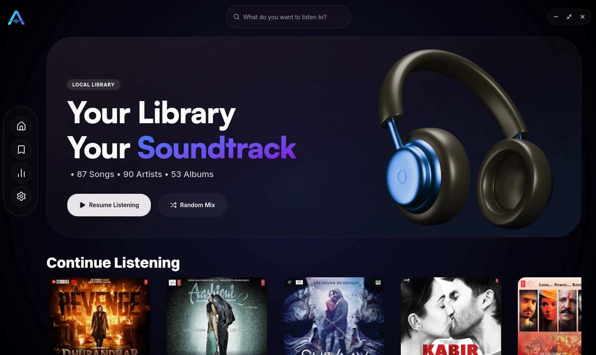
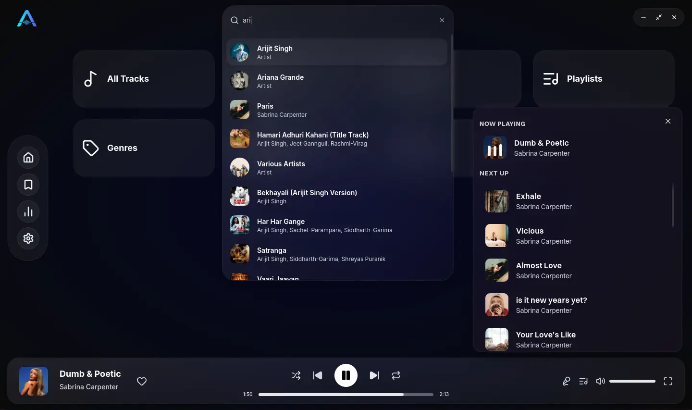
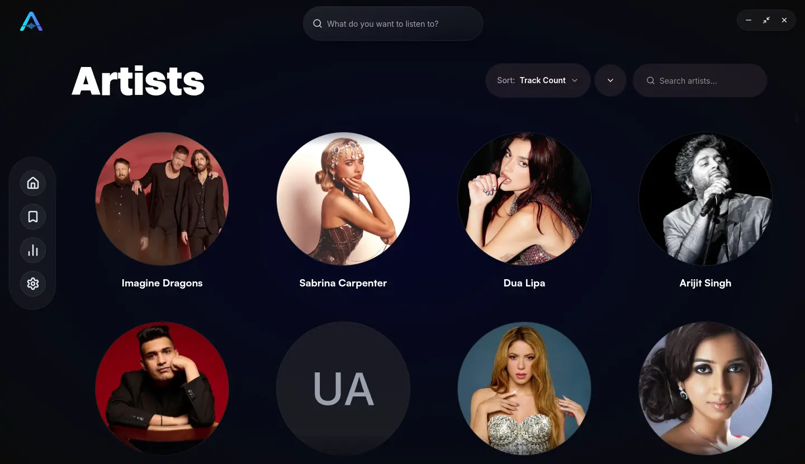
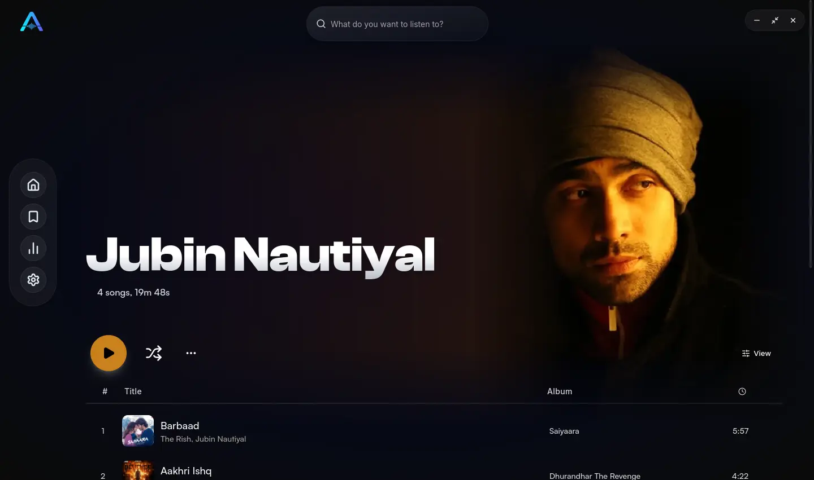
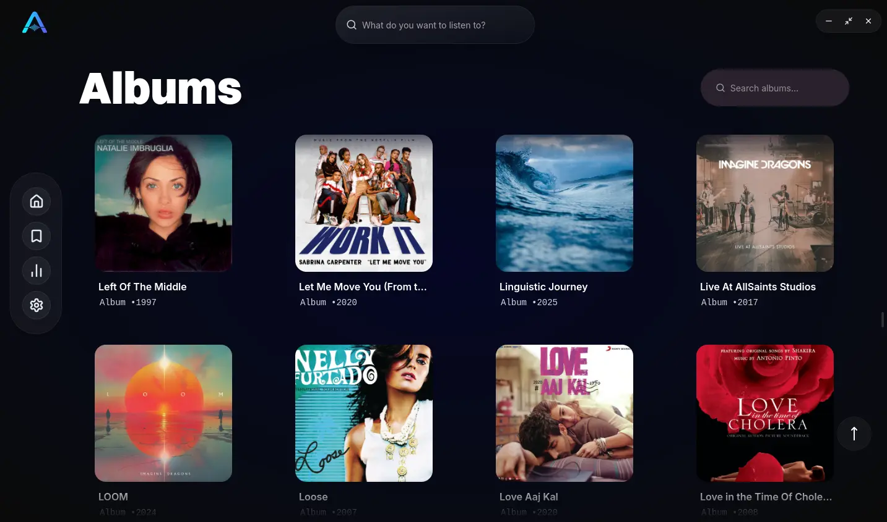
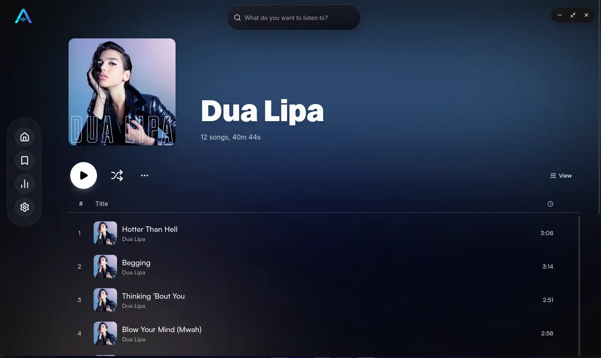
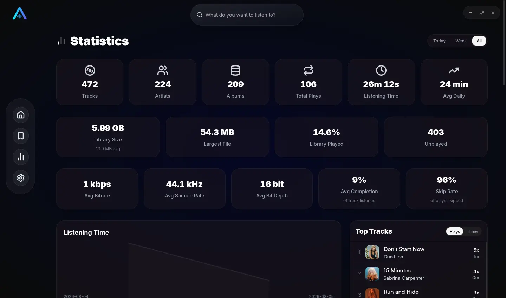
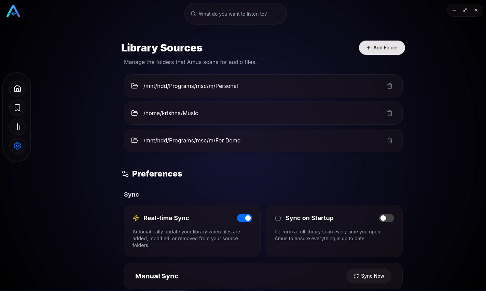
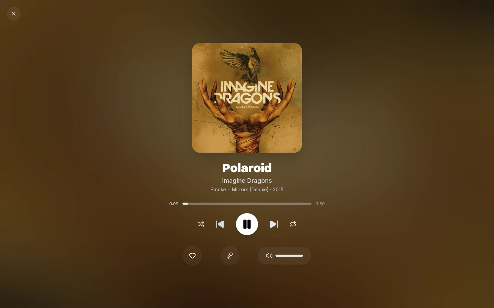
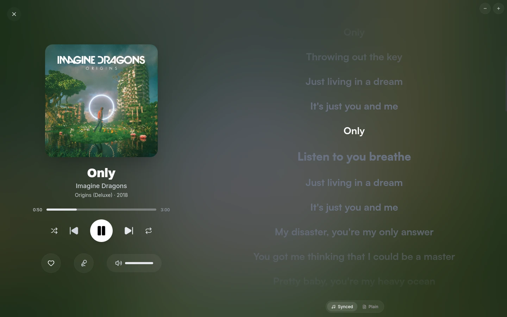

<div align="center">


# AMUS

**A fast, modern, privacy-focused local music player**

AMUS is built for people who own their music library. It runs completely offline, stays lightweight, and feels like a native desktop app — not a bloated web wrapper.

[](LICENSE)
[](https://www.rust-lang.org/)
[](https://tauri.app/)
[](https://kit.svelte.dev/)
[](https://github.com/Naitik4516/AMUS/releases/latest)

</div>

---

## 📑 Table of Contents

- [Screenshots](#-screenshots)
- [Features](#-features)
  - [Playback & Queue](#playback--queue)
  - [Library & Metadata](#library--metadata)
  - [Lyrics & UI](#lyrics--ui)
- [Advanced Search](#-advanced-search)
- [CLI Interface](#-cli-interface)
- [Installation](#-installation)
- [Build & Run](#-build--run)
- [Architecture & Tech Stack](#-architecture--tech-stack)
- [Roadmap](#-roadmap)
- [Troubleshooting & FAQ](#-troubleshooting--faq)

---

## 📸 Screenshots

<p align="center">
  
  
</p>

<details>
<summary><b>View More Screenshots (Artists, Albums, Stats, Lyrics & Settings)</b></summary>
<br>

<p align="center">
  
  
</p>

<p align="center">
  
  
</p>

<p align="center">
  
  
</p>

<p align="center">
  
  
</p>

</details>

---

## ✨ Features

### Playback & Queue
- **Wide Format Support** — MP3, FLAC, WAV, OGG, M4A, AAC, OPUS.
- **Advanced Queue** — Play next, drag-and-drop reorder, shuffle, and repeat modes.
- **Smart Autoplay** — Auto-suggests similar tracks from matches, play count, and randomness when the queue ends.
- **Background Playback & Mini-Player** — Minimizes to the system tray; features a sleek always-on-top compact window.
- **Fullscreen & Lyrics View** — Immersive fullscreen mode with transport controls and synchronized lyrics.

### Library & Metadata
- **Fast Incremental Scanning** — Metadata extraction and real-time cover art caching.
- **Real-time File Watcher** — Auto-detects added, modified, or removed files.
- **Metadata Editor** — Edit track, album, artist, and genre info directly; custom cover art selector.
- **Playlists & Favorites** — One-click favorites toggle; create playlists with auto-generated art and "Add More" suggestions.
- **Artist Profiling** — Optional automatic fetching of artist profile banners via Last.fm and Deezer.

### Lyrics & Interface
- **Built-in Lyrics Engine** — Synced and plain lyrics via [lrclib.net](https://lrclib.net) with manual editing capabilities.
- **Fuzzy Global Search** — Powered by Fuse.js with slash commands (`/tracks`, `/artists`, `/albums`).
- **Rich Context Menus & Shortcuts** — Right-click controls, app-wide hotkeys, and global media key integration (MPRIS/SMTC).
- **Listening Stats** — Dynamic graphs for play count, listening time, format distributions, and hourly/weekly heatmaps.

---

## 🔍 Advanced Search

Open global search and type normally for fuzzy matching, or use **extended query syntax** to narrow down results. Search can be combined with category scopes (e.g., `/tracks belver` or `/artists ^Tu`).

| Token | Match Type | Example / Description |
| :--- | :--- | :--- |
| `belver` | Fuzzy match | Matches items similar to *belver* (e.g., "Believer") |
| `="Rebel"` | Exact match | Matches items that equal exactly *Rebel* |
| `'lofi` | Include match | Items containing *lofi* |
| `!lofi` | Inverse exact | Items that **do not** contain *lofi* |
| `^Tu` | Prefix match | Items starting with *Tu* |
| `!^Tu` | Inverse prefix | Items **not** starting with *Tu* |
| `na$` | Suffix match | Items ending with *na* |
| `!na$` | Inverse suffix | Items **not** ending with *na* |

> [!TIP]
> - Space-separated terms act as an **AND** operation.
> - Use `|` for an **OR** search (e.g., `'jazz | 'blues`).
> - Press `Tab` to accept ghost auto-complete suggestions.

---

## 💻 CLI Interface

The `amus` executable doubles as a powerful IPC remote control for running instances, or launches the player headlessly in the background.

```bash
amus <command> [options]
```

### Quick Commands Reference

| Command | Description |
| :--- | :--- |
| `amus` | Start the GUI application |
| `amus play [paths...]` | Resume playback or play files/folders/globs |
| `amus play -s <query>` | Play top search result for a query |
| `amus pause` / `stop` / `toggle` | Basic transport playback controls |
| `amus next` / `prev` | Skip or go back tracks |
| `amus seek <+offset|-offset|val>` | Seek position in seconds (e.g., `amus seek +30`) |
| `amus volume <val>` | Set or adjust volume percentage (e.g., `amus volume 80`) |
| `amus status` | Display current track metadata, state, and position |
| `amus queue show` / `clear` | Display or clear current playback queue |
| `amus playlist play <name>` | Start playing a specific playlist |
| `amus library rescan` | Force rescan of all configured library sources |
| `amus info <path>` | Print local metadata for an audio file offline |
| `amus reset` | Reset DB, settings, and cache (use `--force` to bypass prompt) |

<details>
<summary><b>View Usage Examples</b></summary>

```bash
# Play specific files or whole directories
amus ~/Music/album.flac ~/Downloads/track.mp3
amus ~/Music

# Search and queue
amus play -s "artist:Radiohead"
amus queue add ~/Music/New\ Albums/*.flac

# Playlist Management
amus playlist create "Late Night"
amus playlist add "Late Night" ~/Music/jazz.mp3
amus playlist play "Late Night"
```
</details>

---

## 📦 Installation

<p align="center">
  <a href="https://github.com/Naitik4516/AMUS/releases/latest">
    
  </a>
</p>

Pre-compiled binaries are available on the **[Releases Page](https://github.com/Naitik4516/AMUS/releases/latest)** for **Windows (x64)**, **Linux (x64)**, and **macOS (Intel & Apple Silicon)**.

### Arch Linux (AUR)

```bash
paru -S amus
# or
yay -S amus
```

> [!WARNING]
> **AUR Updates Notice:** Direct pushes to the AUR package are currently paused. If the AUR package is outdated, install the `.deb` package using `debtap`:
> 1. Download the `.deb` file from Releases.
> 2. Convert and edit: `debtap AMUS_*_amd64.deb`
> 3. Remove `depend = gtk` in `.PKGINFO` when prompted by your editor.
> 4. Install the package: `sudo pacman -U amus-*-x86_64.pkg.tar.zst`

---

## 🛠️ Build & Run from Source

### Prerequisites

1. [Tauri v2 Prerequisites](https://v2.tauri.app/start/prerequisites/) (Rust toolchain, C compiler, GTK dependencies)
2. [Bun Runtime](https://bun.sh/)

```bash
# Clone repository
git clone https://github.com/Naitik4516/AMUS.git
cd AMUS

# Install dependencies and start development server
bun install
bun tauri dev
```

---

## 🛠 Tech Stack & Architecture

| Layer | Technology |
| :--- | :--- |
| **Shell** | Tauri v2 (Rust) |
| **Frontend** | SvelteKit 5 (SPA mode), Svelte 5 Runes |
| **Styling** | Tailwind CSS v4, shadcn-svelte, Lucide Icons |
| **Audio Engine** | Rust (`rodio`, `lofty` for metadata tagging) |
| **Database** | SQLite (`rusqlite` with WAL mode enabling concurrent access) |
| **Animations** | GSAP, Lenis (Smooth scrolling) |

<details>
<summary><b>📁 Project Directory Layout</b></summary>

```text
amus/
├── src/                              # SvelteKit Frontend (SPA)
│   ├── lib/                          # State management ($state runes), commands, stores
│   ├── components/                   # UI primitives & custom components
│   ├── routes/                       # App views (library, artists, albums, miniplayer)
│   └── styles/                       # Tailwind theme configuration
├── src-tauri/                        # Rust Backend
│   ├── migrations/                   # SQLite database migrations
│   └── src/
│       ├── main.rs                   # Entry point (CLI vs GUI mode execution)
│       ├── db.rs                     # Queries, schema management & stats
│       ├── scanner.rs                # Multi-threaded scanner (Rayon + Lofty)
│       ├── player/                   # Actor-based audio backend (Rodio)
│       └── media_controls.rs         # OS media integration (souvlaki)
```
</details>

---

## 🗺️ Roadmap

- [x] OS Media Controls integration 
- [x] CLI Remote Control interface
- [x] Mini-Player & Always-on-top mode
- [x] Lyrics fetching ([lrclib.net](https://lrclib.net))
- [ ] Audio Normalization (ReplayGain)
- [ ] Gapless playback & Silence Skipping
- [ ] Equalizer & DSP Effects
- [ ] Recommendation System 
- [ ] Smart Playlists
- [ ] Sleep timer

---

## ❓ FAQ & Troubleshooting

### Frequently Asked Questions

**Does AMUS track my data or require an account?**  
No. AMUS is completely offline and private. External network connections are only used for optional lyrics/artist image scraping (which can both be toggled off in settings).

**Is this a vibe-coded / fully AI-generated project?**  
No. AMUS is a personal project I designed and built. I use AI tools (including coding agents and autocomplete) for implementation help and boilerplate — especially while learning Rust or working through low-level pieces. Some areas (for example parts of the scanner and sync logic) had substantial AI assistance. Everything is reviewed, tested, and integrated by me; architecture, features, and maintenance are intentional human decisions.

### Troubleshooting

> [!TIP]
> **App Crashes or Blank Screen on Launch**
> You can easily reset your cache and DB state without losing local media files:
> ```bash
> amus reset --force
> ```
> Alternatively, click **Reset App Data** on the crash error screen.

> [!NOTE]
> **CLI binary not found on Windows**  
> If `amus` commands are not recognized, ensure the installation folder is added to your system environment `PATH`, or re-run the NSIS installer.

---

## 📜 License

Distributed under the [Mozilla Public License 2.0](LICENSE).
